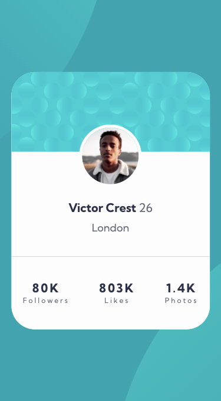

# Frontend Mentor - Profile card component solution

This is a solution to the [Profile card component challenge on Frontend Mentor](https://www.frontendmentor.io/challenges/profile-card-component-cfArpWshJ). Frontend Mentor challenges help you improve your coding skills by building realistic projects.

## Table of contents

- [Overview](#overview)
  - [The challenge](#the-challenge)
  - [Screenshot](#screenshot)
  - [Links](#links)
- [My process](#my-process)
  - [Built with](#built-with)
  - [What I learned](#what-i-learned)
  - [Useful resources](#useful-resources)
- [Author](#author)
- [Acknowledgments](#acknowledgments)

## Overview

### The challenge

- Build out the project to the designs provided

### Screenshot

 

### Links

- Solution URL: [Add solution URL here](https://your-solution-url.com)
- Live Site URL: [Github Page](https://adrianna-thomas.github.io/profile-card-component/)

## My process

### Built with

- Semantic HTML5 markup
- CSS custom properties
- Flexbox

### What I learned

How to put two background images in the same background.

```css
body {
  background-image: url(./images/bg-pattern-top.svg), url(./images/bg-pattern-bottom.svg);
  background-repeat: no-repeat, no-repeat;
  background-position: right 50vw bottom 50vh, left 50vw top 50vh;
}
```

### Useful resources

- [Example resource 1](https://www.youtube.com/watch?v=NZpG9EBKYWc) - This helped me with making the background images fit the design.

## Author

- Frontend Mentor - [@adrianna-thomas](https://www.frontendmentor.io/profile/adrianna-thomas)

## Acknowledgments

[Mr Coder Youtube Video] (https://www.youtube.com/watch?v=NZpG9EBKYWc)
